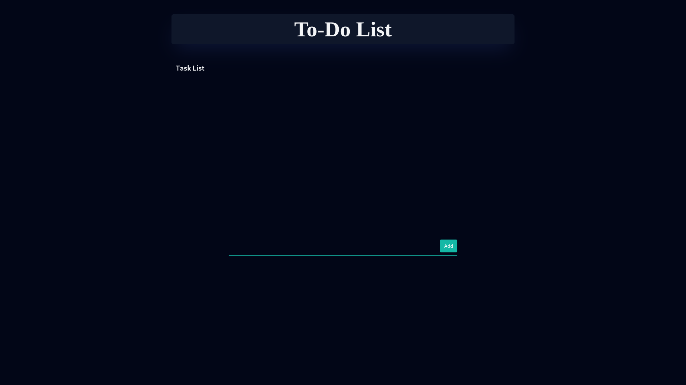
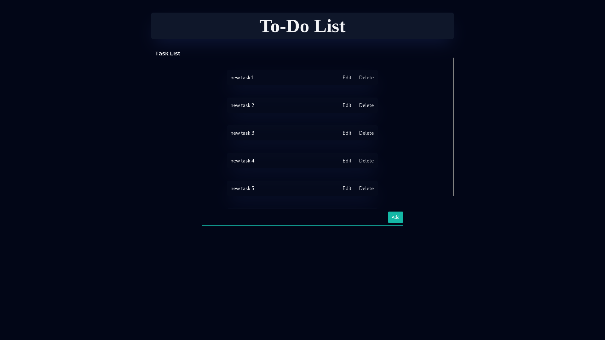
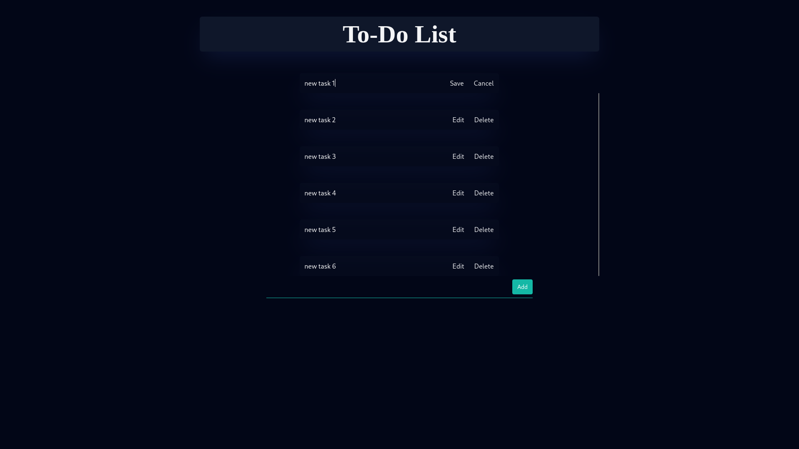
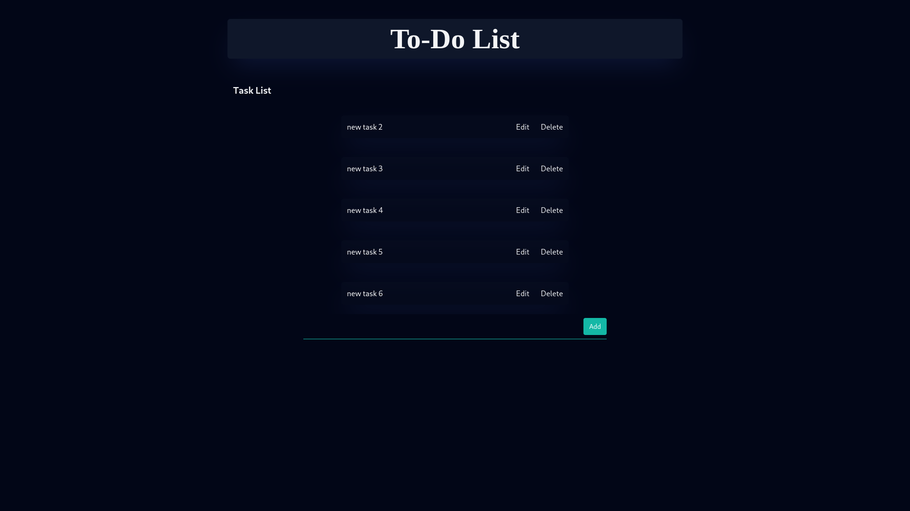

# To-Do React App

This project was bootstrapped with [Create React App](https://github.com/facebook/create-react-app).

## Available Scripts

In the project directory, you can run:

### `npm start`

Runs the app in the development mode.\
Open [http://localhost:3000](http://localhost:3000) to view it in the browser.

The page will reload if you make edits.\
You will also see any lint errors in the console.

### `npm test`

Launches the test runner in the interactive watch mode.\
See the section about [running tests](https://facebook.github.io/create-react-app/docs/running-tests) for more information.

### `npm run build`

Builds the app for production to the `build` folder.\
It correctly bundles React in production mode and optimizes the build for the best performance.

## The layout

## Features

- Add and remove to-do items
- Edit to-do items
- Responsive design for mobile and desktop

## Description

This is a simple to-do app built with React. It allows users to add and remove to-do items, mark items as complete, and filter items by status. The app also has a responsive design that works well on both mobile and desktop devices.
