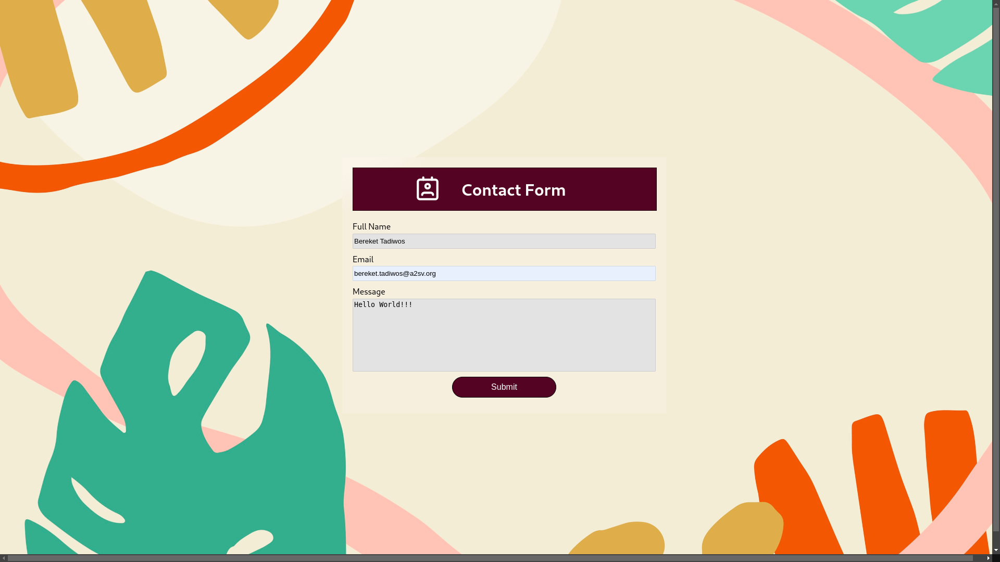
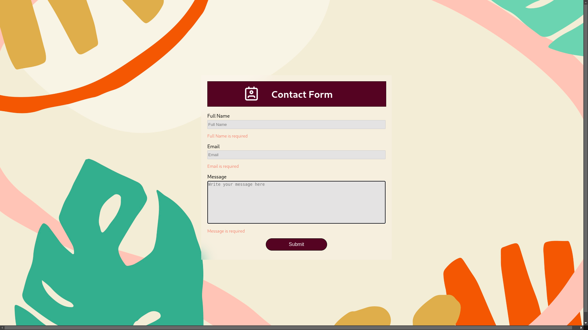

# Contact Form

This is a simple contact form built with React and CSS. The form sends an email to the specified address when the user submits it.

## Installation

1. Clone the repository.
2. Run `npm install` to install the dependencies.
3. Run `npm start` to start the development server.

## Usage

1. Open your web browser and navigate to `http://localhost:3000`.
2. Fill out the form with your name, email, and message.
3. Click the "Submit" button.
4. You should see a confirmation message saying "Thank you for contacting us!".
5. Check your email to see if the form was sent successfully.

## Layout

 

## Contributing

Pull requests are welcome. For major changes, please open an issue first to discuss what you would like to change.

Please make sure to update tests as appropriate.

## License
