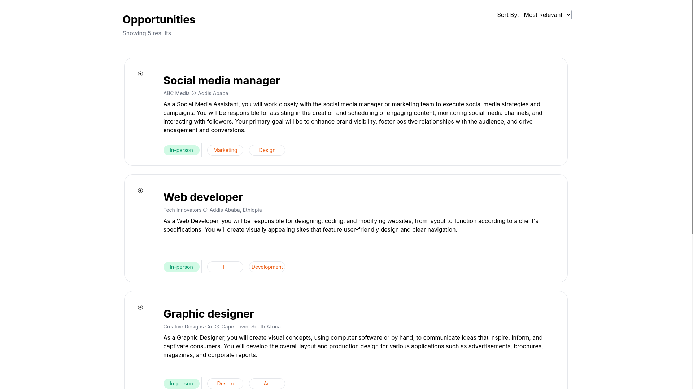
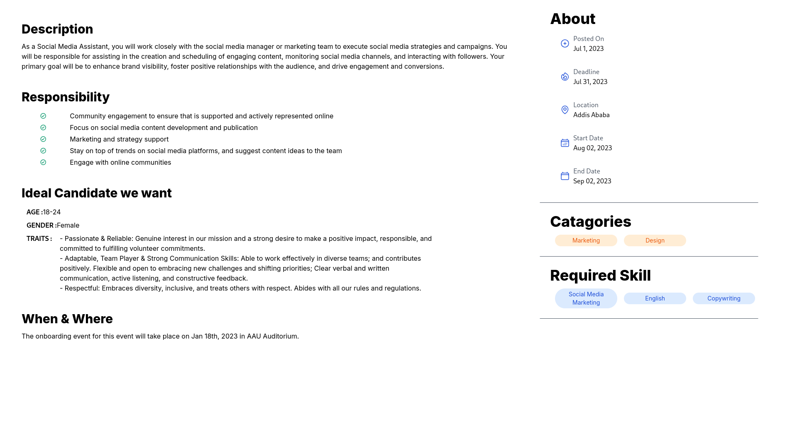
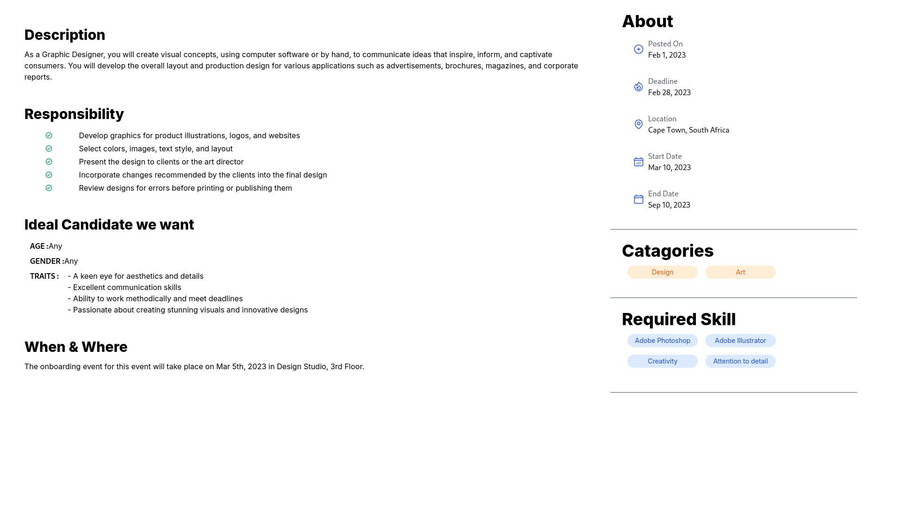
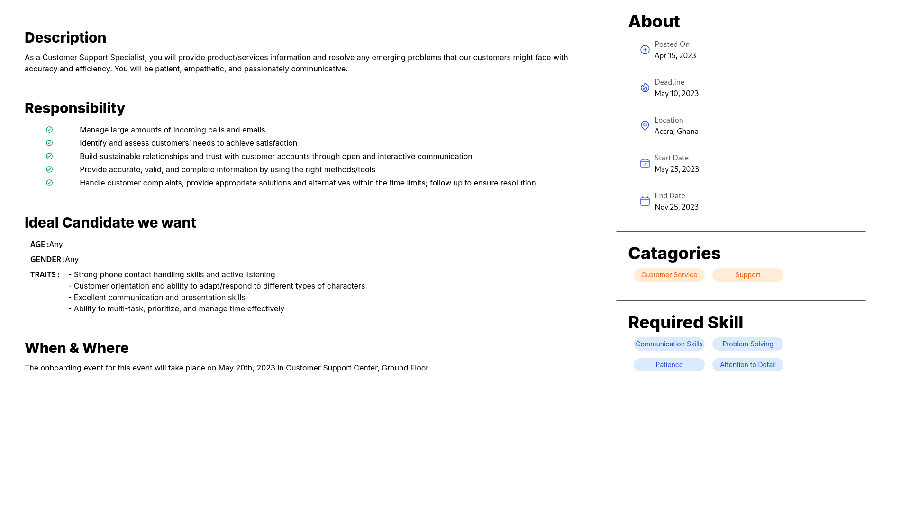
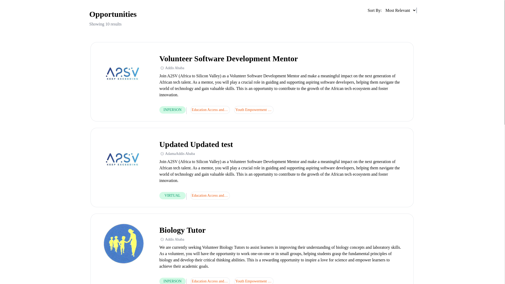
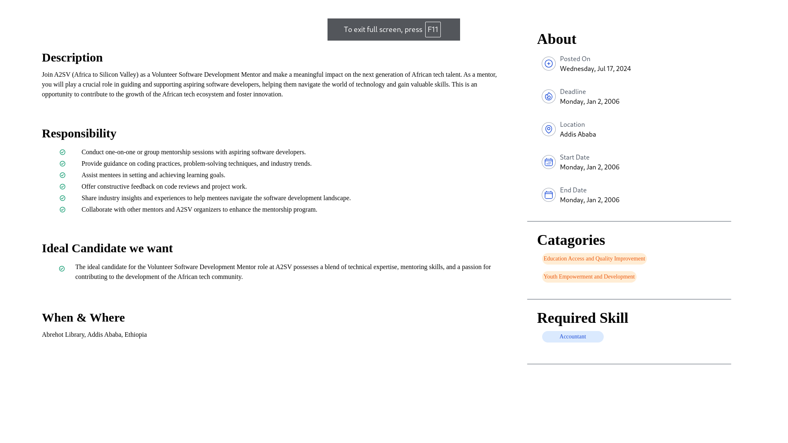
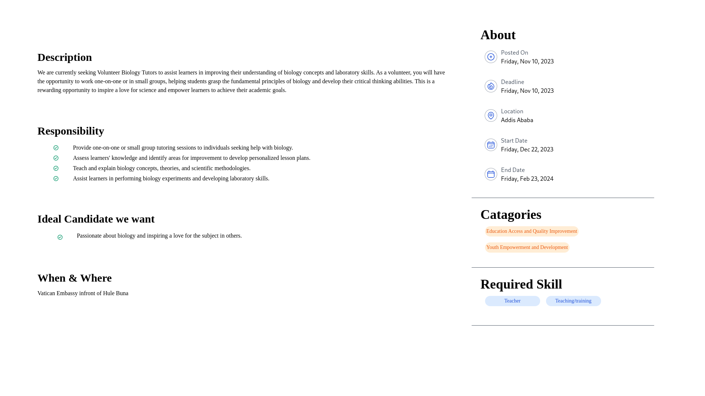

# Job Listing App

## Description

This is a job listing app where users can browse and search for job listings, apply for jobs, and manage their applications.

## Features

- User authentication and authorization
- Job listing functionality with filtering and search capabilities
- Application management for job seekers
- Employer dashboard for managing job postings and applications
- Responsive design for optimal user experience across different devices

## Layout for Task 6

 

 

 

## Layout for Task 7

 

 

## Installation

1. Clone the repository: `git clone https://github.com/BEKI77/A2SV-Project-Phase/Task-6.git`
2. Navigate to the project directory: `cd job-listing-app`
3. Install dependencies: `npm install`
4. Set up the database: configure the database connection in the `config/database.js` file
5. Start the server: `npm start`

## Usage

1. Register as a job seeker or employer to create an account.
2. Browse job listings and search for specific positions.
3. Apply for jobs by submitting your resume and cover letter.
4. Manage your applications on the job seeker dashboard.
5. Post job listings and manage applications on the employer dashboard.

## Contributing

Contributions are welcome! If you find any issues or have suggestions for improvements, please open an issue or submit a pull request.

## License

This project is licensed under the [MIT License](LICENSE).